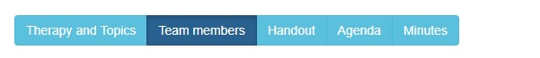

# widget_togglebutton
Conditionnal tab widget. You can show / hide a tab 

Here the widget in action

Give a list of key / value in JSON
 "navigationbar" : [
    {
      "label": "Therapy and Topics",
      "key": "THERAPY"
    },
        {
      "label": "Team members",
      "key": "TEAMMEMBERS"
    }
,    {
      "label": "Handout",
      "key": "HANDOUT"
    }
,    {
      "label": "Agenda",
      "key": "AGENDA"
    }
,    {
      "label": "Minutes",
      "key": "MINUTES"
    }

     ],
 Note: you can calculate the list in JAVASCRIPT to have a complete dynamique tab, to be able to add tab if user selects some values for example
 
 Then link the widget to a value like "currenttab"
 
 Then, hide / show containers according the currenttab key :
 hidden : currenttab === "THERAPY"

